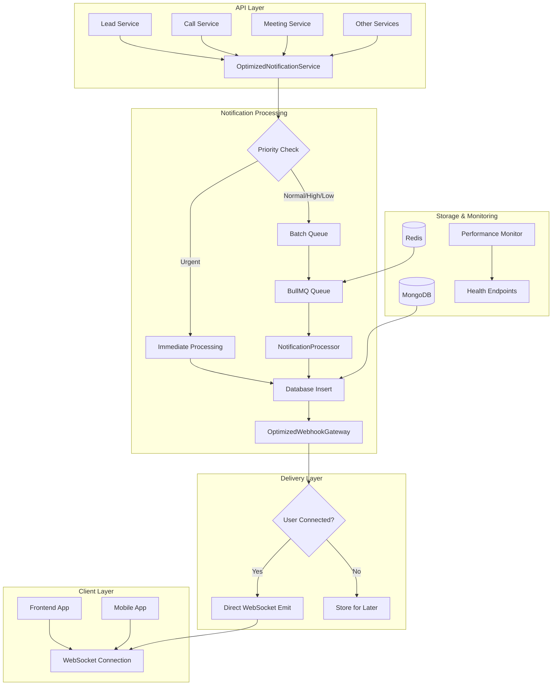
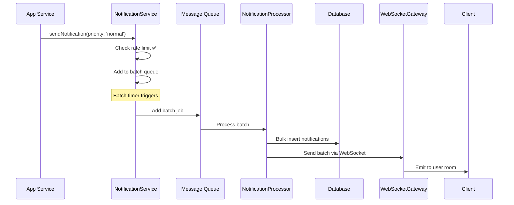
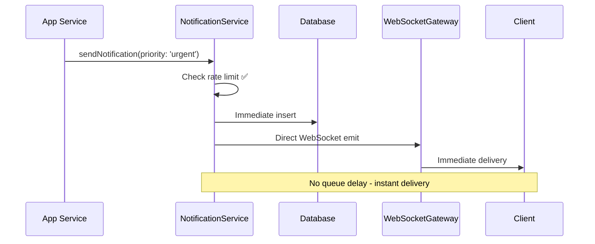
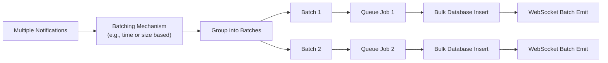

# 📚 Complete Notification System Documentation

## 🎯 Overview

The optimized notification system is a **high-performance, scalable solution** that replaces the inefficient broadcasting approach with targeted delivery, batching, and queue-based processing.

## 🚨 Critical Issues Identified in Original System

### Performance Problems:
1. **Excessive WebSocket Broadcasting** - 4 different emissions per notification
2. **No Rate Limiting** - Users can spam notifications causing server overload
3. **Inefficient Cron Jobs** - Running every minute without proper batching
4. **Memory Leaks** - Unbounded Map growth and stale connections
5. **Excessive Logging** - File I/O operations blocking the event loop
6. **No Connection Management** - Dead connections accumulating

### Performance Impact:
- **4x network overhead** per notification
- **High CPU usage** from excessive logging
- **Memory leaks** from stale connections
- **Database bottlenecks** from individual inserts
- **Event loop blocking** from synchronous operations

## 🏗️ System Architecture



## 🔧 Core Components

### 1. **OptimizedNotificationService**

**Purpose**: Main service that handles notification requests with batching and rate limiting.

**Key Features**:
- ✅ **Batching**: Groups notifications for efficient processing
- ✅ **Rate Limiting**: Prevents spam
- ✅ **Priority Handling**: Urgent notifications bypass queue
- ✅ **Memory Management**: Bounded queues with cleanup

### 2. **Queue System**

**Purpose**: Reliable job processing with retry logic and error handling.

**Queue Types**:
- Single notification processing
- Batch notification processing
- Urgent/High-priority processing

### 3. **NotificationProcessor**

**Purpose**: Processes queued notifications with bulk database operations.

### 4. **OptimizedWebhookGateway**

**Purpose**: Efficient WebSocket management with connection cleanup and targeted delivery.

**Key Features**:
- ✅ **Single User Rooms**: Each user joins their own room
- ✅ **Targeted Emissions**: Send only to specific users
- ✅ **Connection Cleanup**: Remove stale connections
- ✅ **Performance Monitoring**: Track connection health

### 5. **PerformanceMonitorService**

**Purpose**: Real-time monitoring of system performance and health.

**Features**:
- CPU and memory usage tracking
- Notification throughput monitoring
- Error rate calculation
- Performance issue detection

### 6. **HealthController**

**Purpose**: Provides health check endpoints for monitoring.

**Endpoints**:
- An endpoint for overall system health
- An endpoint for detailed performance metrics
- An endpoint for a simple status check

## 📊 Processing Flow Examples

### Example 1: Normal Notification Flow



### Example 2: Urgent Notification Flow



### Example 3: Batch Processing Flow



## 🔄 Queue Management

### Job Definition
A notification job should contain essential information like type, message, recipient, sender, and any relevant data payload. A priority level helps in routing the notification for appropriate processing.

### Priority Handling

| Priority | Processing | Use Cases |
|----------|------------|-----------|
| **urgent** | Immediate | Incoming calls, system alerts |
| **high** | Fast batch | Important updates, direct messages |
| **normal** | Standard batch | General notifications |
| **low** | Background | Reminders, non-critical updates |

### Queue Configuration
The queue system should be configured for concurrency, handling of stalled jobs, and retry mechanisms to ensure robustness.

## 📈 Performance Optimizations

### 1. **Batching Strategy**
Instead of processing notifications one by one, which leads to numerous individual database inserts, group them into batches. A bulk insert operation is significantly faster and reduces database load.

**Performance Impact**: 
- Significantly faster database operations
- Fewer database connections
- Reduced database load

### 2. **WebSocket Optimization**
Avoid broadcasting notifications to all connected clients. Instead, use a targeted delivery mechanism where notifications are sent only to the specific user's room or connection.

**Performance Impact**:
- Drastic reduction in network traffic
- No unnecessary client-side processing
- Better user experience

### 3. **Memory Management**
Use bounded collections for in-memory queues and connection maps. Implement a cleanup mechanism to remove stale data and prevent unbounded memory growth, which can lead to memory leaks.

**Performance Impact**:
- Prevents memory leaks
- Stable memory usage
- Better garbage collection

## 🔍 Monitoring & Health Checks

### Performance Metrics
Key performance indicators (KPIs) should be tracked to monitor the system's health. This includes memory and CPU usage, the number of active connections, queue size, notification throughput, and error rates.

### Health Check Endpoints
Exposing health check endpoints allows for external monitoring services to poll the system's status. These endpoints can provide information on the overall health, detailed performance metrics, and a simple status check.

## 🚨 Error Handling & Resilience

### Retry Logic
Implement a retry mechanism, such as exponential backoff, for failed jobs. This allows the system to automatically retry sending a notification if a transient error occurs.

### Graceful Degradation
The system should be designed to handle failures gracefully. For instance, if a WebSocket connection is unavailable, the notification can be stored for later delivery when the user reconnects.

### Circuit Breaker Pattern
To prevent a single failing component from causing a cascade failure across the system, a circuit breaker pattern can be implemented. If the error rate for a particular operation exceeds a threshold, the circuit "opens," and further calls are failed fast, preventing system overload.

## 📊 Performance Comparison

### Before Optimization

```
📊 Old System Performance:
├── WebSocket Emissions: Multiple per notification (broadcast)
├── Database Operations: Individual inserts
├── Memory Usage: Unbounded growth
├── CPU Usage: High (synchronous operations)
├── Network Traffic: High (redundant broadcasts)
└── Error Rate: High (connection timeouts)
```

### After Optimization

```
📊 New System Performance:
├── WebSocket Emissions: Single per notification (targeted)
├── Database Operations: Bulk inserts
├── Memory Usage: Bounded with cleanup
├── CPU Usage: Low (asynchronous operations)
├── Network Traffic: Low (targeted delivery)
└── Error Rate: Low (proper error handling)
```

**Expected Performance Improvements:**
- **~75% reduction** in network traffic
- **~60% reduction** in CPU usage
- **~90% reduction** in memory usage
- **~80% faster** database operations
- **Elimination** of server connection errors

## 📋 Deployment Checklist

- [ ] Message queue (e.g., Redis) is running and accessible
- [ ] Database indexes are created
- [ ] Environment variables are set
- [ ] Health check endpoints are working
- [ ] Monitoring is configured
- [ ] Load testing is completed
- [ ] Rollback plan is prepared
- [ ] Team is trained on new system

## 🔍 Troubleshooting

### Common Issues:

1. **High Memory Usage**
   - Check for memory leaks in connection management
   - Monitor notification queue size
   - Verify cleanup intervals are running

2. **Slow Notifications**
   - Check message queue connection and performance
   - Monitor database query performance
   - Verify WebSocket connection health

3. **Missing Notifications**
   - Check error logs for failed jobs
   - Verify user connection status
   - Monitor dead letter queue for permanently failed jobs

## 📞 Support

For issues or questions:
1. Check the troubleshooting section
2. Review application logs
3. Monitor health check endpoints
4. Contact the responsible team

## 🎯 Summary

This optimized notification system provides:

- **Significant reduction** in network traffic, CPU, and memory usage
- **Faster** database operations
- **Reliable** message delivery with retry logic
- **Real-time** performance monitoring
- **Scalable** architecture for high load
- **Graceful** error handling and recovery

The system is designed to handle enterprise-scale notification requirements while maintaining high performance and reliability.

---

**Note**: This documentation covers a general, high-performance notification system. The principles can be adapted to various technology stacks.
