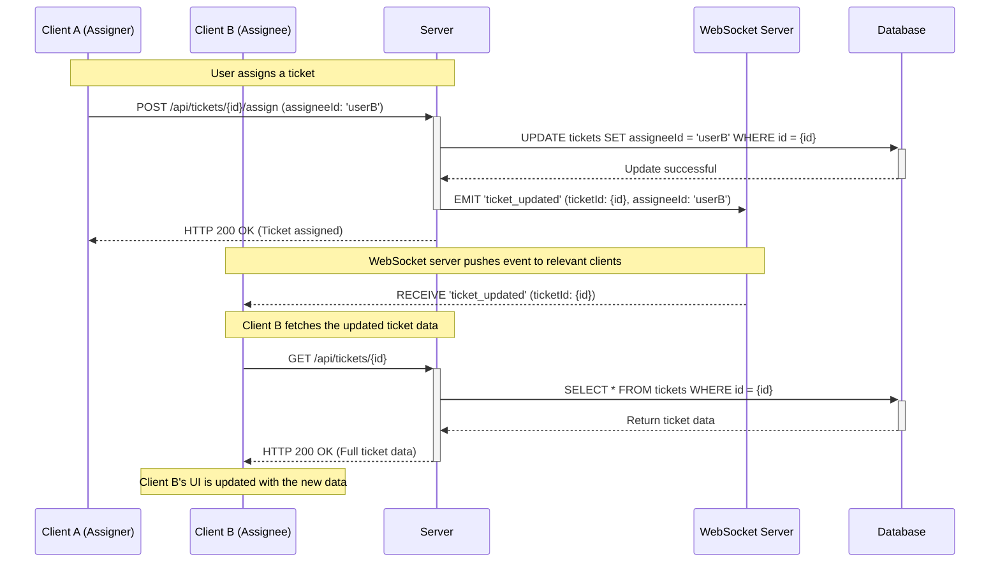

# Hybrid Real-Time Update Strategy for CRM

## 🎯 Problem Statement

In the current CRM system, ticket assignments and updates require a manual page refresh to reflect changes. This leads to a disjointed user experience, where users may not have the most up-to-date information without manual intervention. The goal is to implement a real-time data sync mechanism so that users can see updates (like ticket assignments) instantly without reloading the page.

## ✅ Chosen Strategy: Hybrid Real-Time Update

We will use a hybrid approach that leverages both **WebSockets** for event signaling and **REST APIs** for data fetching. This strategy provides a scalable, clean, and production-friendly solution that balances real-time capabilities with system stability.

### Why a Hybrid Approach?

- **Scalability**: WebSockets are used for lightweight signals, not for sending large data payloads. This reduces the load on the WebSocket server and makes it easier to scale.
- **Data Consistency**: The REST API remains the single source of truth for data. This avoids data duplication and ensures that the client always fetches the most up-to-date information.
- **Simplicity**: It separates the real-time signaling logic from the data-fetching logic, making the system easier to develop, debug, and maintain.
- **Robustness**: If the WebSocket connection fails, the application can fall back to traditional polling or manual refreshes without breaking the core functionality.

---

## 📊 System Architecture Diagram

Here is a diagram illustrating the flow of information in the hybrid real-time update system:



---

## 📝 Real-Time Example: Ticket Assignment

Let's walk through a real-world scenario of a ticket being assigned to a support agent.

**Scenario**: A manager assigns a new high-priority ticket to an agent. The agent should see this new ticket appear on their dashboard instantly.

### Step-by-Step Flow:

1.  **Manager Assigns Ticket (Client A)**:
    *   The manager is on the CRM dashboard and assigns "Ticket #123" to "Agent Smith".
    *   The frontend application sends a `POST` or `PUT` request to the server.
        ```http
        POST /api/tickets/123/assign
        Content-Type: application/json

        {
          "assigneeId": "agent-smith-id"
        }
        ```

2.  **Server Processes the Request**:
    *   The server receives the request and validates it (e.g., checks permissions).
    *   It updates the ticket's `assigneeId` in the database.
        ```sql
        UPDATE tickets SET assigneeId = 'agent-smith-id' WHERE id = 123;
        ```

3.  **Server Emits a WebSocket Event**:
    *   After successfully updating the database, the server connects to the WebSocket server and emits a lightweight event.
    *   This event does not contain the full ticket data, only a signal that something has changed. The event is broadcasted to a specific room or channel that "Agent Smith" is subscribed to.
        ```javascript
        // Example using Socket.IO on the server
        io.to('user_room:agent-smith-id').emit('ticket_updated', {
          ticketId: 123,
          message: "A ticket has been assigned to you."
        });
        ```

4.  **Agent Receives the Event (Client B)**:
    *   "Agent Smith" is on their dashboard, and their client application is listening for WebSocket events.
    *   The client receives the `ticket_updated` event.

5.  **Agent's Client Fetches Full Data**:
    *   Upon receiving the event, the client knows that "Ticket #123" has been updated.
    *   It then makes a standard REST API call to fetch the complete, up-to-date details for that ticket.
        ```http
        GET /api/tickets/123
        ```

6.  **UI is Updated**:
    *   The server responds with the full ticket data, including the new assignment, status, and other details.
    *   The client application uses this data to update the UI in real-time. "Agent Smith" sees "Ticket #123" appear on their "My Open Tickets" list without ever hitting the refresh button.

---

## 🚀 Implementation Considerations

### Backend (NestJS Example)

-   **WebSocket Gateway**: Use NestJS's `@WebSocketGateway()` to handle WebSocket connections and events.
-   **Rooms/Channels**: To ensure that only relevant clients receive updates, use rooms. A user should join a room specific to them upon authentication (e.g., `user_room:<userId>`).
-   **Service Integration**: Inject the WebSocket gateway into your services (e.g., `TicketService`) to emit events after database operations.

```typescript
// src/modules/ticket/ticket.service.ts
import { Injectable } from '@nestjs/common';
import { AppGateway } from '../../gateway/app.gateway'; // Your WebSocket gateway

@Injectable()
export class TicketService {
  constructor(private readonly appGateway: AppGateway) {}

  async assignTicket(ticketId: string, assigneeId: string): Promise<void> {
    // 1. Database logic to assign the ticket
    // ...

    // 2. Emit a WebSocket event to the assignee
    this.appGateway.server.to(`user_room:${assigneeId}`).emit('ticket_updated', {
      ticketId,
      message: `Ticket ${ticketId} has been assigned to you.`,
    });
  }
}
```

### Frontend (React Example)

-   **WebSocket Client**: Use a library like `socket.io-client` to connect to the WebSocket server.
-   **State Management**: Use a state management library (like Redux, Zustand, or React Query) to handle data fetching and UI updates.
-   **Event Listeners**: Set up event listeners to react to incoming WebSocket messages and trigger data refetches.

```javascript
// Example using React Query and Socket.IO
import { useQueryClient } from 'react-query';
import socket from './socket'; // Your configured socket.io client

function useTicketRealtimeUpdates() {
  const queryClient = useQueryClient();

  useEffect(() => {
    // Listen for ticket update events
    socket.on('ticket_updated', (data) => {
      console.log(data.message);
      // Invalidate the query for the specific ticket, which will trigger a refetch
      queryClient.invalidateQueries(['ticket', data.ticketId]);
      // Or invalidate a list of tickets
      queryClient.invalidateQueries('tickets');
    });

    return () => {
      socket.off('ticket_updated');
    };
  }, [queryClient]);
}
```

This hybrid approach ensures a responsive, scalable, and maintainable real-time system that enhances the user experience without over-complicating the architecture.
